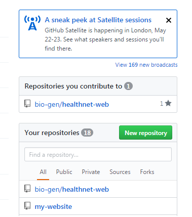

# Publish your website on the Internet with GitHub and Heroku

**TL;DR** This is a step-by-step tutorial for uploading your projects to [GitHub](http://github.com/) and hosting your static websites on [Heroku](http://heroku.com).

## I. Upload a project to GitHub

GitHub is a web-based Git or version control repository and Internet hosting service. In other words, it lets you upload all sorts of projects to their site and make them publicly available. You can upload websites, software projects, graphic design portfolios, or even your own collection of writings! GitHub is a great way of showing off your work to potential employers, universities or the public in general.

GitHub now also counts with an awesome new feature called [GitHub Pages](http://pages.github.com/), which can host one static website for free, but that's a topic for another day.

### 1. Create an account on GitHub
Sign up for a new account on [GitHub](http://github.com/).
*Make sure you confirm your email account before continuing.*

### 2. Create a GitHub repository for your project
If you are new on GitHub, you will see a screen like this, where you need to click "Start a Project":


If you already have other repositories on GitHub, you can create a new one by clicking on "New repository" as shown below:


### 3. Download and install Git

Git is a free and open source distributed version control system designed to handle everything from small to very large projects with speed and efficiency. We will be using this tool to upload our projects to GitHub and Heroku.

#### Windows
Download the latest version of Git from [here](http://git-for-windows.github.io/).

Unless you know what you're doing, do not change any of the default Git settings when installing.
`Next->Next->Next->...->Install`

#### Mac
Follow the steps provided [here](http://www.atlassian.com/git/tutorials/install-git).
*Only follow the steps given in the section named **Git for Mac Installer**. Don't do the steps in the following sections (Install Git with Homebrew, etc.).*

#### Make sure Git is installed

Go to the command line (Windows) or terminal (Mac) and type:
```sh
$ git --version
```

You should see something like this:
```sh
$ git version 2.7.0
```

### 4. Upload your project
Open the command line or terminal on your computer and navigate to your project folder.