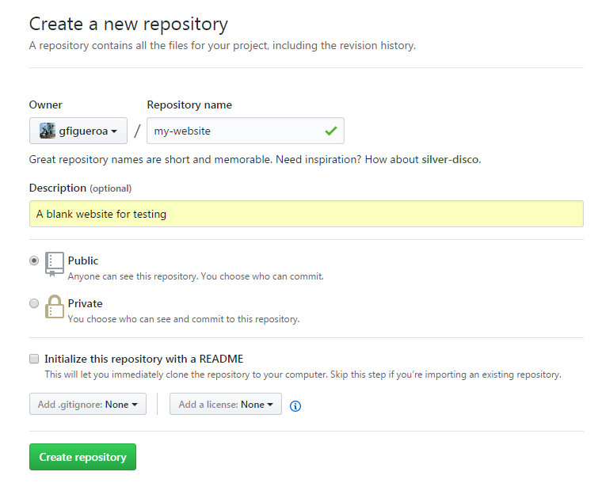

# Publish your website on the Internet with GitHub and Heroku
Created by: [Gerardo Figueroa](http://github.com/gfigueroa)

**TL;DR** This is a step-by-step tutorial for uploading your projects to [GitHub](http://github.com/) and hosting your static websites on [Heroku](http://heroku.com). We will use Git and the command line for doing tasks.

## I. Upload a project to GitHub
GitHub is a web-based Git or version control repository and Internet hosting service. In other words, it lets you upload all sorts of projects to their site and make them publicly available. You can upload websites, software projects, graphic design portfolios, or even your own collection of writings! GitHub is a great way of showing off your work to potential employers, universities or the public in general.

GitHub now also counts with an awesome new feature called [GitHub Pages](http://pages.github.com/), which can host one static website for free, but that's a topic for another day.

### 1. Create an account on GitHub
Sign up for a new account on [GitHub](http://github.com/).
*Make sure you confirm your email account before continuing.*

### 2. Create a GitHub repository for your project
If you are new on GitHub, you will see a screen like this, where you need to click "Start a Project":


If you already have other repositories on GitHub, you can create a new one by clicking on "New repository" as shown below:


We will now fill in some information about the new repository we are creating. In this tutorial, we will create a simple website on our computer and upload it to GitHub and Heroku.

For repository name, we will use `my-website`. In the description, we will write `A blank website for testing`, choose `Public` repository. Then, click on `Create repository`. 
**Note:** Unless you have previously created a repository with this name, everything should work out perfectly.



In the next screen, we will be provided with the URL for our newly created repository on GitHub. It should look something like this:
```
https://github.com/your-user-name/my-website.git
```

*Make not of this URL, as we will need it later!*

Our repository is now ready on GitHub for us to upload our files into it from our computer using Git.

### 3. Download and install Git on your computer
Git is a free and open source distributed version control system designed to handle everything from small to very large projects with speed and efficiency. We will be using this tool to upload our projects to GitHub and Heroku.

#### Windows
Download the latest version of Git from [here](http://git-for-windows.github.io/).

Unless you know what you're doing, do not change any of the default Git settings when installing.
`Next->Next->Next->...->Install`

#### Mac
Follow the steps provided [here](http://www.atlassian.com/git/tutorials/install-git).
*Only follow the steps given in the section named **Git for Mac Installer**. Don't do the steps in the following sections (Install Git with Homebrew, etc.).*

#### Make sure Git is installed
Open the command line (Windows) or terminal (Mac) and enter:
```sh
$ git --version
```

You should see something like this (or a newer version):
```sh
$ git version 2.7.0
```

### 4. Upload your project

#### Create a blank website on your computer
In this tutorial, we are creating a new website to upload to GitHub and Heroku. You can skip this step if you wish to upload an already existing project or website.

Create a new folder on your computer called `My Website`. Inside that folder, add three files named `index.html`, `style.css`, and `script.js`. Your folder structure should look like this:
```
/My Website/
    ./index.html
    ./style.css
    ./script.js
```

We will only add some stuff into `index.html`, so open that file with your favorite text editor and add the following HTML code into it:
```html
<!DOCTYPE html>
<html>
	<head>
		<title>My Website</title>
	</head>
	<body>
		<h1>My Website</h1>
	</body>
</html>
```
Save and close the file.

#### Navigate to your project folder
Open the command line (Windows) or terminal (Mac) on your computer and navigate to your project folder.

If you are new to the Windows command line or Mac terminal, you can see the following steps to navigate to your project folder, otherwise you can skip the following step.

##### Windows
Click on the Start menu of your computer and type `cmd`, then press `Enter` on your keyboard. This will open up your command line.

If your website folder is not located on `C:\` drive, you must change the current drive you are on by entering the name of the drive followed by a colon (`:`):
```sh
$ d:
```
To get the full path of your website directory, an easy way is to open the Windows Explorer and go to the folder (mine is located on `D:\Comm Design\My Website`):


Then, click on the navigation bar at the top and copy the whole path with `Ctrl + c`:


Go back to the command line, type the `cd` command, paste your path, and press `Enter`:
```sh
$ cd paste-your-path-here
```
**Note:** To paste your path, you must right click on the command line and select `Paste` from the pop-up menu. You cannot do `Ctrl + v` here!

You can then make sure that you are on the right directory by entering the following command, which should list your folder contents:
```sh
$ dir
```

Your command line should look like this by now:


##### Mac
Open the terminal by searching in the Finder and typing in `terminal`.

Navigate to your folder by using the `cd` command. For example, if the website folder is in my desktop in the directory `/Users/gfigueroa/Desktop/Comm Design/My Website`, then I need to type:
```sh
$ cd "/Users/gfigueroa/Desktop/Comm Design/My Website"
```
**Note:** Since my directory has some spaces inside it, I need to wrap it around double quotes `""`.

You can then make sure that you are on the right directory by entering the following command, which should list your folder contents:
```sh
$ ls
```

#### Upload with Git
Now that we're in our project folder on the command line/terminal, we will perform some Git commands in order to upload our website to GitHub. 

Remember that URL from GitHub we got a note of a few steps back? We're going to copy it and paste it in a second on the command line/terminal. 


After copying the URL, enter the following commands (only enter the text that appears after a dollar sign `$`):
```sh
$ git init
Initialized empty Git repository in D:/Comm Design/My Website/.git/
$ git remote add origin paste-your-url-here

$ git remote -v
origin  https://github.com/gfigueroa/my-website.git (fetch)
origin  https://github.com/gfigueroa/my-website.git (push)
```
The first command `git init` sets the current directory as a local Git repository. The second command `git remote add origin...` adds our remote repository in GitHub (the one we will upload to). The third command `git remote -v` is to check that the remote repository was successfully added.

Now, we will **add** all our files to the local repository, **commit** the changes (more on this on our next tutorial), and **push** everything (upload) to our remote repository on GitHub. Enter the following commands:
```sh
$ git add .

$ git commit -m "Initial commit"
[master (root-commit) 21a58cc] Initial commit
 Committer: Figueroa <Figueroa>
Your name and email address were configured automatically based
on your username and hostname. Please check that they are accurate.
You can suppress this message by setting them explicitly. Run the
following command and follow the instructions in your editor to edit
your configuration file:

    git config --global --edit

After doing this, you may fix the identity used for this commit with:

    git commit --amend --reset-author

 3 files changed, 10 insertions(+)
 create mode 100644 index.html
 create mode 100644 script.js
 create mode 100644 style.css
 
$ git push origin master
Username for 'https://github.com': gfigueroa
Password for 'https://gfigueroa@github.com':
Counting objects: 4, done.
Delta compression using up to 4 threads.
Compressing objects: 100% (3/3), done.
Writing objects: 100% (4/4), 377 bytes | 0 bytes/s, done.
Total 4 (delta 0), reused 0 (delta 0)
To https://github.com/gfigueroa/my-website.git
 * [new branch]      master -> master
 
```
The third command `git push origin master` might ask you to enter your GitHub username and password.
**Note:** When you type in the password, you won't be able to see what you're typing!

Ready! Our project should now be available on GitHub for the whole world to see! Just refresh your GitHub repository page on the browser and you will see what's inside.


Mine is available at https://github.com/gfigueroa/my-website.

## II. Host a website on Heroku
Now that our project code is publicly available at GitHub, it's time to actually publish the website so that anybody anywhere in the world can access it on a browser. For that, we will be using a hosting provider called [Heroku](http://www.heroku.com/).

Heroku is a cloud Platform-as-a-Service (PaaS) supporting several programming languages that is used as a web application deployment model. We will only deploy a static website to Heroku on this tutorial.

### 1. Create an account on Heroku
Sign up for a new account on http://signup.heroku.com/.
Select `PHP` as the Primary Development Language.
*You need to confirm your email account before continuing.*

### 2. Create a Heroku app
We need to create a new Heroku App where our website will be hosted. After logging in to Heroku, click on the `Create New App` button.

On the following screen, you will need to enter an app name (this must be unique across the entire world). Try using the name `FirstInitialLastName-my-website`. For example, the app name I will use is (unfortunately, `gfigueroa-my-website` was already used!):
```
gcalderon-my-website
```
**Note:** We need to make note of this app name, as we will need it later!
Select `United States` as the Runtime Selection and click on the `Create App` button.

### 3. Download and install the Heroku CLI
We will need to install yet another piece of software on our computer called the Heroku CLI (also known as Heroku Toolbelt). This software will also run on the command line/terminal.

Go to the following [link](http://devcenter.heroku.com/articles/heroku-cli) and follow the steps required for your operating system until you do the **Verify your installation** step.
**Note:** Do not do anything from the **Getting started** step onwards.

*You might need to close and reopen your command line/terminal before getting the Heroku CLI to work.*

### 4. Upload your website to Heroku
#### Add PHP file
First, we will need to add a new file into our website folder on our computer. This file will tell Heroku how to run our website.
Create a new file named `index.php` and put the following code inside it using your favorite text editor:
```php
<?php header( 'Location: /index.html' ) ;  ?>
```
Save the file.

Go back to the command line/terminal and navigate to your project folder. If you enter the `dir` (Windows) or `ls` (Mac) command, you should be able to see the new `index.php` file that we just added.

#### Log in to Heroku in the command line/terminal
Type in the following command to log in to Heroku from the command line/terminal:
```sh
$ heroku login
heroku-cli: Installing CLI... 17.14MB/17.14MB
Enter your Heroku credentials:
Email: gerardo.figueroa@has.hc.edu.tw
Password: ***********
Logged in as gerardo.figueroa@has.hc.edu.tw
```
Note that you will need to log in with the email and password you entered on Heroku.

#### Create remote repository for Heroku
Now, we need to add a new remote repository in our directory that will point to the Heroku app. 
```sh
$ heroku git:remote -a your-heroku-app-name
set git remote heroku to https://git.heroku.com/gcalderon-my-website.git
```
Make sure there are two remote repositories in your directory by entering the following command:
```sh
$ git remote -v
heroku  https://git.heroku.com/gcalderon-my-website.git (fetch)
heroku  https://git.heroku.com/gcalderon-my-website.git (push)
origin  https://github.com/gfigueroa/my-website.git (fetch)
origin  https://github.com/gfigueroa/my-website.git (push)
```

#### Deploy your website
Now, we will need to **add** the new PHP file, **commit** the changes, and **push** the entire thing to our Heroku repository:
```sh
$ git add .

$ git commit -m "Added PHP file for Heroku"

$ git push heroku master
```
After entering those three commands, the last output lines should look something like this:
```sh
...
remote: -----> Compressing...
remote:        Done: 13.6M
remote: -----> Launching...
remote:        Released v3
remote:        https://gcalderon-my-website.herokuapp.com/ deployed to Heroku
remote:
remote: Verifying deploy... done.
To https://git.heroku.com/gcalderon-my-website.git
 * [new branch]      master -> master
```

#### Access your website
Eureka! Now we should be able to access our website on a browser by going to the link given to you after pushing your app to Heroku. In my case it was https://gcalderon-my-website.herokuapp.com/.